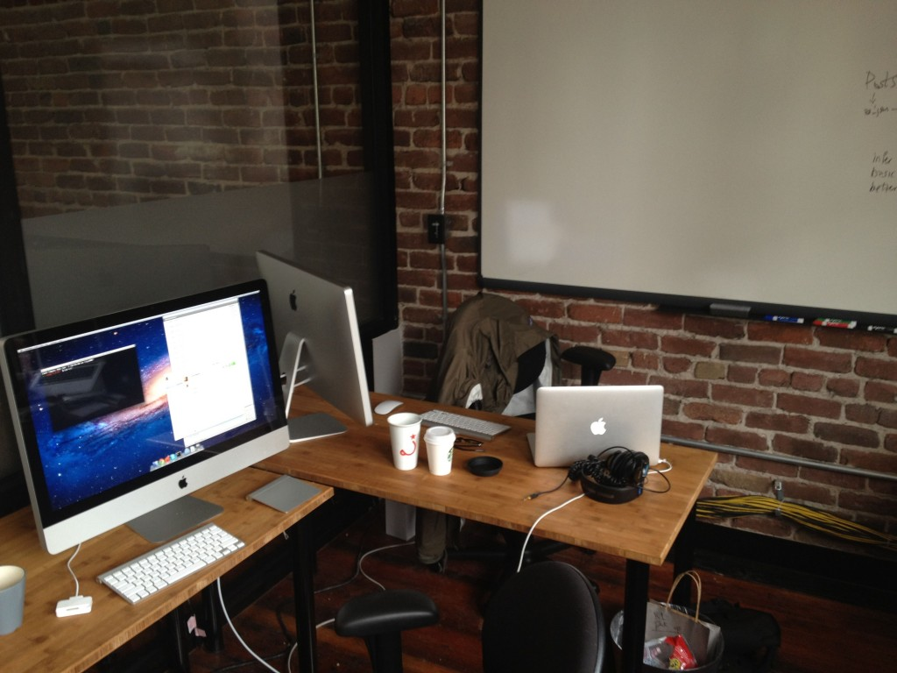
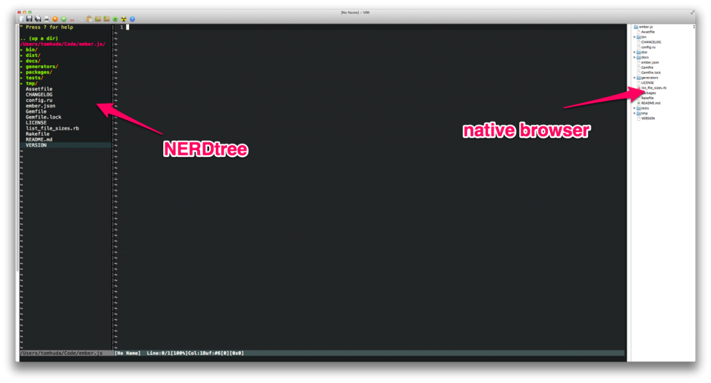
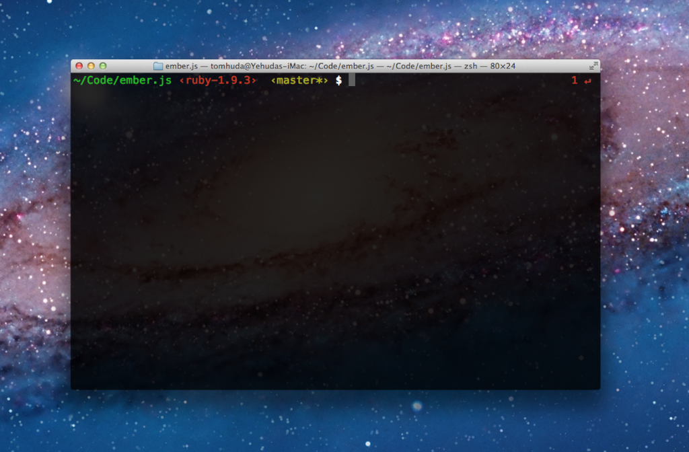

Yehuda Katz and I spend the majority of our time pair programming on client projects and on our open source projects like Ember.js. As in any profession, it's important to be ["foaming at the mouth crazy" about your tools](http://www.randsinrepose.com/archives/2009/11/02/the_foamy_rules_for_rabid_tools.html).

Since Tilde moved into our new offices, we've finally put together what I think is our dream setup that I wanted to share.

## Hardware

The crown jewel of the setup is a brand new 3.4GHz 27" iMac with a 256GB SSD and 1TB hard drive. This thing absolutely screams, and is a joy to use. On our last pairing setup (a Mac mini with a 5400rpm hard drive), we would cringe when we had to bootup VMware to test Internet Explorer. On this thing, you can't even tell that you're running Windows virtualized. It's insanely responsive.

We prefer being able to face each other, and modeled our setup after [Josh Susser's post about his pairing setup at Pivotal](http://pivotallabs.com/users/jsusser/blog/articles/1505-pairing-tete-a-tete). Sitting side-by-side has always felt awkward to me; and the ability to easily have a face-to-face conversation is critical. This also allows us to more easily deliver high-fives after slaying a particularly hard bug.

We orient our desks at a right angle, and plug an external 27" Thunderbolt Display into the iMac with mirroring turned on. This allows us both to see the same content at the same resolution. We both get a Bluetooth keyboard, and Yehuda uses a Magic Trackpad while I prefer the Magic Mouse. The ability to have your own space to keep drinks and other personal belongings is a big win. I can also customize the keyboard to my liking, since I prefer mapping Caps Lock to the Control key and Yehuda hates it. When we're not pairing, we can use either the Thunderbolt Display or the iMac as external monitors for our laptops. The display also serves as a nice USB hub for charging iPhones or other devices.

Perhaps most critically, we hung the biggest whiteboard we could find on the wall next to our station. There are few problems a good whiteboard diagram can't fix.

## Software

Yehuda and I both use MacVIM with [Janus](https://github.com/carlhuda/janus) as our editor. One major point of contention was file navigation: I prefer NERDtree and Yehuda prefers [alloy's fork of MacVim with a native file browser](https://github.com/alloy/macvim). (The native file browser drives me absolutely fucking crazy because I can't navigate using just the keyboard; I have to pick up the mouse.)

We almost came to blows over this, but now that we have a 27" display, we agreed to just use both.

&nbsp;

We use zsh with [oh-my-zsh](https://github.com/robbyrussell/oh-my-zsh). Our shell displays both the current git branch (if applicable), as well as the current Ruby version. Both of these have saved us countless hours of hair-pulling. We manage Ruby versions with Wayne Seguin's indispensable [rvm](http://beginrescueend.com/), the Ruby version manager.

For communcation, we use Propane to hang out in various Campfire rooms and iChat to log on to AIM, where we have separate pair accounts so that there is no feeling of invaded privacy. We use Dropbox and Lion's AirDrop feature to shuttle files back and forth, and use the surprisingly powerful speakers in the Thunderbolt Display to do our standups via Skype.

I couldn't be happier with our setup. If you haven't tried pairing, I recommend it; while it sometimes feels slower, you avoid many of the obvious mistakes that one can make when spending hours in isolation. I also think that the software you write tends to be better if it's constantly being sanity-checked by someone else.

If you have your own pairing setup, what improvements would you make to ours?

**Edit**: I forgot the most important component of a successful pairing setup:

**Edit 2**: Updated to clarify that the second display is mirrored.
