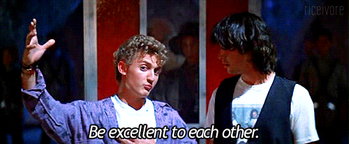

Yesterday, [Heather Arthur posted a well-written and sad account](http://harthur.wordpress.com/2013/01/24/771/) of how she felt after the open ridicule of one of the projects she had made available on GitHub.

This caused the battle lines to be lain between the Ruby and node.js communities. Friends of mine opened fire at one another. That made me sad.

Thanks to the internet some of my closest friends are Ruby developers. Some of my closest friends are also node developers. Seeing friends get pilloried by other friends based on a lapse of judgment that doesn't represent them, at all, made me sad.

A few things.

First of all, let's be clear that the kind of thing Steve and Corey did *absolutely happens* in the node community. There is no room for self-righteousness here. I know because it happened to me:

<blockquote class="twitter-tweet" width="500">
I threw up; view-source:<a href="http://t.co/5HNVmJp2" title="http://emberjs.com/examples/simple_bindings/">emberjs.com/examples/simpl…</a>
&mdash; Paolo Fragomeni (@hij1nx) <a href="https://twitter.com/hij1nx/status/179671483294035968">March 13, 2012</a></blockquote>

(My reaction to this was disappointment, because I had had a great time previously hanging out with Paolo at the AustinJS party at SXSW. Thanks Joe McCann! It stings to know someone you like personally thinks your work is sufficiently bad as to induce nausea.)

Sometimes I think the internet is unhealthy for us. When someone violates community norms, the reaction is vociferous and its intent seems to be to punish rather than to help. The Steve Klabnik I know is one of the most empathetic sweethearts I've ever met, and I can guarantee that he has already beat himself up over this; far worse than anything strangers on Twitter could do.

Similarly, despite Paolo's ridicule of my work, I don't bear any ill will for him. I suspect he was just in a cranky mood and took it out on my work as a way to help him feel better. It's lazy, easy, and unproductive, but it works. I know because I do it all the time (cf. any of my tweets about Turbolinks or MongoDB).

So, takeaways:

* If someone pulls an asshole move, give them the benefit of the doubt. The internet lynchmob thing is so 2012\. Remember that typically what you're doing is [reinforcing your own internal narrative](http://words.steveklabnik.com/narratives).
* The Ruby and node communities are different. They value different things. One is not a threat to the other, but we sure act like it. I wrote [a post on Google+](https://plus.google.com/111465598045192916635/posts/CkmmbjmvebM) about the responsibilities I think are associated with releasing open source software. Mikeal Rogers wrote a great reply about how [those rules don't apply in the node community](http://www.futurealoof.com/posts/generation-gap.html). I think these two posts explain a lot of the friction between the two communities.
* I think it is valid for people to get upset if they see someone else trying to convince someone to use code that, in their opinion, is bad. It is right to try to protect your friends from perceived danger. Perhaps this would be mitigated by having a way to differentiate between:
  * Here is some braindump/learning code, I make no guarantees about the quality or fitness of this code.
  * I wrote this thing; I believe it is better than alternative solutions and you should use it. I am signing up to maintain it to the best of my abilities. Criticism welcome.

I think eliminating misunderstandings is the key to getting the two communities to work together. I think we need each other more than we might realize.

<blockquote class="twitter-tweet" width="500">
There are two ways to handle your success in open source software. Burn out on haters, or become a sociopath ignoring everyone’s opinions.
&mdash; Michael Koziarski (@nzkoz) <a href="https://twitter.com/nzkoz/status/294323277952843776">January 24, 2013</a></blockquote>

But seriously, you node people really do want to reinvent everything. It's exhausting trying to keep up.

<blockquote class="twitter-tweet" width="500">
@<a href="https://twitter.com/substack">substack</a> what are you talking about now dude? Why do you keep trying to reinvent programming?
&mdash; Marco Rogers (@polotek) <a href="https://twitter.com/polotek/status/281955044495081473">December 21, 2012</a></blockquote>

Just kidding.

