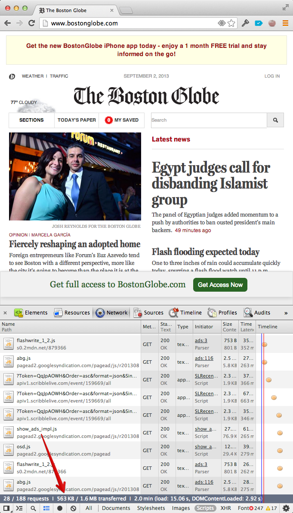

I've got bad news: Progressive enhancement is dead, baby. It's dead. At least for the majority of web developers.

A few days ago, Daniel Mall launched a snarky tumblr called [Sigh, JavaScript](http://sighjavascript.tumblr.com/). I was reminded of [law enforcement agencies that release a "wall of shame" of men who solicit prostitutes](http://www.telegraph.co.uk/news/worldnews/northamerica/usa/10099235/Long-Island-lawyers-surgeons-and-socialites-on-prostitution-wall-of-shame.html). ((It is coincidence that the police commissioner is also named Thomas Dale)) The goal here is to publicly embarrass those who fall outside your social norms; in this case, it's websites that don't work with JavaScript disabled. 

The religious devotion to progressive enhancement was useful in a time when web development was new and browsers were still more like bumbling toddlers than the confident, lively young adults they've grown to become.

Something happened a few years ago in web browser land. Did you notice it? I didn't. At least not right away.

At some point recently, **the browser transformed from being an awesome interactive document viewer into being the world's most advanced, widely-distributed application runtime.**

Developer communities have a habit of crafting mantras that they can repeat over and over again. These distill down the many nuances of decision-making into a single rule, repeated over and over again, that the majority of people can follow and do approximately the right thing. This is good.

However, the downside of a mantra is that the original context around why it was created gets lost. They tend to take on a sort of religious feel. I've seen in-depth technical discussions get derailed because people would invoke the mantra as an axiom rather than as having being derived from first principles. (["Just use bcrypt" is another one.](http://www.unlimitednovelty.com/2012/03/dont-use-bcrypt.html))

Mantras are useful for aligning a developer community around a set of norms, but they don't take into account that the underlying assumptions behind them change. They tend to live on a little bit beyond their welcome.

[embed]https://twitter.com/trek/status/372703510262853633[/embed]

Many proponents of progressive enhancement like to frame the issue in a way that feels, to me, a little condescending. Here's Daniel Mall again in [his follow-up post](http://danielmall.com/articles/progressive-enhancement/):

> Lots of people don’t know how to build sites that work for as many people as possible. That’s more than ok, but don’t pretend that it was your plan all along.

Actually, Daniel, I do know how to build sites that work for as many people as possible. However, I'm betting my business on the fact that, by building JavaScript apps from the ground up, I can build a better product than my competitors who chain themselves to progressive enhancement.

Take [Skylight](http://skylight.io), the Rails performance monitoring tool I build as my day job. From the beginning, we architected it as though we were building a native desktop application that just _happens_ to run in the web browser. (The one difference is that JavaScript web apps need to have good URLs to not feel broken, which is why we used [Ember.js](http://emberjs.com).)

To fetch data, it opens a socket to a Java backend that streams in data transmitted as [protobufs](https://code.google.com/p/protobuf/). It then analyzes and recombines that data in response to the user interacting with the UI, which is powered by [Ember.js](http://emberjs.com) and [D3](d3js.org).

Probably a short movie illustrates what I'm talking about:

[embed]https://www.youtube.com/watch?v=yE7rJUIcKVU[/embed]

What we're doing wasn't even possible in the browser a few years ago. It's time to revisit our received wisdom.

We live in a time where you can assume JavaScript is part of the web platform. Worrying about browsers without JavaScript is like worrying about whether you're backwards compatible with HTML 3.2 or CSS2\. At some point, you have to accept that some things are just part of the platform. Drawing the line at JavaScript is an arbitrary delineation that doesn't match the state of browsers in 2013.

In fact, [Firefox recently entirely removed the ability to disable JavaScript](http://www.extremetech.com/computing/163291-firefox-23-finally-kills-the-blink-tag-removes-ability-to-turn-off-javascript-introduces-new-logo), a move I applaud them for. (They also removed the `&lt;blink&gt;` tag at the same time—talk about joining the future.)

Embracing JavaScript from the beginning will let you build faster apps that provide UIs that just weren't possible before. For example, think back to the first time you used Google Maps after assuming MapQuest was the best we could do. Remember that feeling of, "Holy crap, I didn't know this was possible in the browser"? That's what you should be aiming for.

Of course, there will always be cases where server-rendered HTML will be more appropriate. But that's for you to decide by analyzing what percentage of your users have JavaScript disabled and what kind of user experience you want to deliver.

Don't limit your UI by shackling yourself to outmoded mantras, because your competitors aren't.

From Daniel's post:

> And sometimes, we don’t realize that “only for people who have JavaScript enabled” also means “not for anyone with a Blackberry” or “not for anyone who works at [old-school organization]” or “not for people in a developing country” or “not for people on the Edge network.”

If those are important parts of your demographic, fine. Run the numbers. But I do take issue with Daniel's last claim here, about Edge networks.

What I've found, counter-intuitively, is that apps that _embrace_ JavaScript actually end up having _less_ JavaScript. Yeah, I know, it's some Zen koan shit. But the numbers speak for themselves.

For example, here's [the Boston Globe's home page](http://bostonglobe.com), with 563kb of JavaScript:

And here's [Bustle](http://bustle.com), a recently-launched Ember.js app. Surprisingly, this 100% JavaScript rendered app clocks in at a relatively petite 141kb of JavaScript.

If you're a proponent of progressive enhancement, I encourage you to really think about how much the browser environment has changed since the notion of progressive enhancement was created. If we had then what we have now, would we still have made the same choice? I doubt it.

And most importantly: **Don't be ashamed to build 100% JavaScript applications.** You may get some incensed priests vituperating you in their blogs. But there will be an army of users (like me) who will fall in love with using your app.

_Thanks to Yehuda Katz for reviewing this draft. Tell me how mad I just made you: [@tomdale](https://twitter.com/tomdale)_
