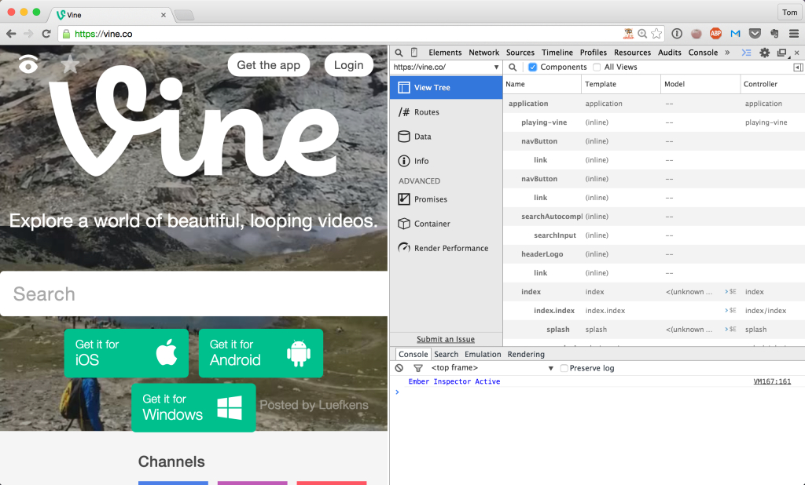

Mozilla prides itself on being a champion of the open web, and largely it is. But one policy continues to increasingly grate: their badly-managed add-on review program.

For background, Ember.js apps rely heavily on conventional structure. We [wrote the Ember Inspector](https://github.com/emberjs/ember-inspector) as an extension of the Chrome developer tools. The inspector makes it easy to understand the structure and behavior of Ember apps, and in addition to being a great tool for debugging, is used to help people learning the framework.

Because we tried to keep the architecture browser-agnostic, [Luca Greco was able to add support for the Firefox API](https://hacks.mozilla.org/2013/12/ember-inspector-on-a-firefox-near-you-2/).

We were excited to support this work because we believe an open web relies on multiple competitive browsers.

However, actually distributing this add-on to users highlights a stark difference between Mozilla and Google.

Though there was an initial review process for adding our extension to the Chrome Web Store, updates after that are approved immediately and rollout automatically to all of our users. This is wonderful, as it lets us get updates out to Ember developers despite our aggressive six-week release cycle. Basically, once we had established credibility, Google gave us the benefit of the doubt when it came to incremental updates.

Mozilla, on the other hand, mandates that each and every update, no matter how minor, be hand vetted. Unfortunately, no one at Mozilla is paid to be a reviewer; they depend on an overstretched team of volunteers.

Because of that, our last review took 35 days. After **over a month**, our update was sent back to us: rejected.

Why?

> Your version was rejected because of the following problems:
> 
> 
> 1) Extending the prototype of native objects like Object, Array and String is not allowed because it can cause compatibility problems with other add-ons or the browser itself. (data/toolbar-button-panel.html line 40 et al.)
> 
> 2) You are using an outdated version of the Add-ons SDK, which we no longer accept. Please use the latest stable version of the SDK: https://developer.mozilla.org/Add-ons/SDK
> 
> 3) Use of console.log() in submitted version.
> 
> 
> Please fix them and submit again. Thank you.

This is ridiculous for a number of reasons. For one, not being able to use `console.log` is a silly reason for rejection and, as Sam Breed points out, is even [included in their add-on documentation](https://developer.mozilla.org/en-US/docs/Web/API/console#Outputting_text_to_the_console). Extending prototypes should not matter at all since the add-on runs in its own realm, and we've been doing this since day one. Getting rejected now feels extremely Apple-esque (or Kafka-esque, but I repeat myself).

But the bottom line is that waiting a month at a time for approval is just not tenable, especially since Google has proven that the auto-approval model works just fine. Worst of all, many Ember.js developers who prefer Firefox have accused us of treating it like a second-class citizen, since they assume the month+ delays are our doing. Losing goodwill over something you have no control over is incredibly frustrating.

At this point, I can not in good conscience recommend that Ember developers use the Ember Inspector add-on from the Mozilla add-ons page. Either compile it from source yourself and set a reminder every few weeks to update it, or switch to Chrome until this issue is resolved.

There are many good people at Mozilla, many of whom I consider friends, and I know this policy is as upsetting to them as it is to me. Hopefully, you can use this post to start a conversation with the decision-makers that are keeping this antiquated, open-source-hostile policy in place.

_Update_

Some people have accused me of writing a linkbaity headline, and that this issue has nothing to do with open source. Perhaps, and apologies if the title offended. The reason it feels particularly onerous to me is that, as an open source project, we're already stretched thin—it's a colossal waste of resources to deal with the issues caused by this policy. If we were a for-profit company, we could just make it someone's job. But no one in an open source community wants to deal with stuff like this on their nights and weekends.
