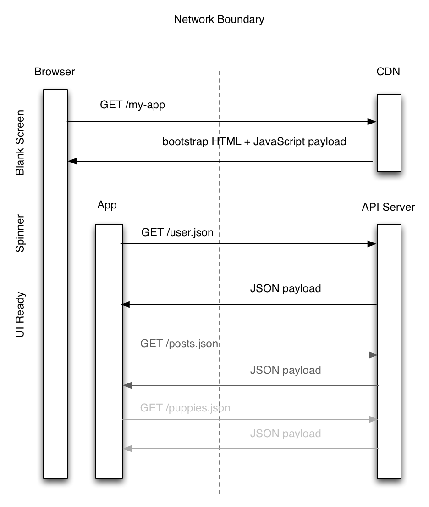
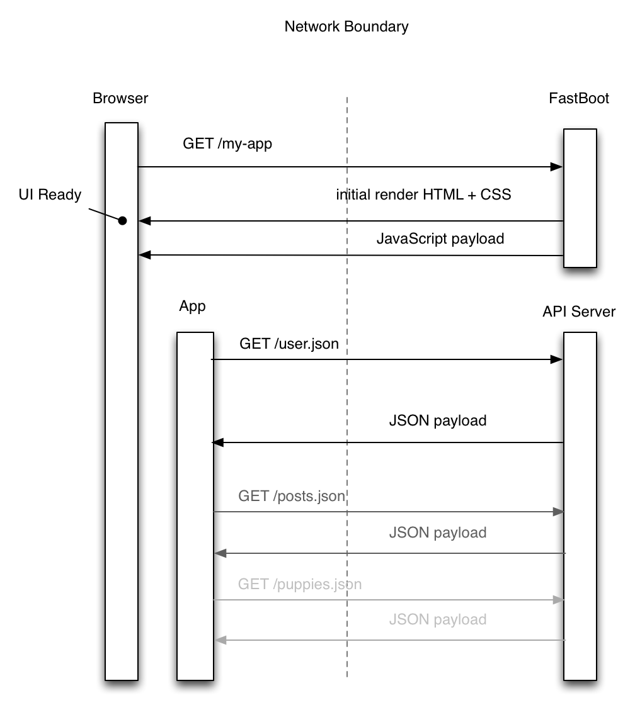

There is a lot of confusion right now about the push to render JavaScript applications on the server-side. Part of this has to do with the awful terminology, but mostly it has to do with the fact that it's a fundamental shift in how we architect and deploy these apps, and the people peddling this idea (myself included) have not done a great job motivating the benefits.

<blockquote class="twitter-tweet" data-lang="en">
<a href="https://twitter.com/tomdale">@tomdale</a> <a href="https://twitter.com/robconery">@robconery</a> i really don&#39;t understand the value, here. why add another layer to do what the server already does?
&mdash; Derick Bailey (@derickbailey) <a href="https://twitter.com/derickbailey/status/563043210650738688">February 4, 2015</a></blockquote>

First, let me make something as clear as I can: **the point of running your client-side JavaScript application on the server is not to replace your existing API server**.

Unfortunately, when most people think of client-JavaScript-running-on-the-server, they think of technologies like Meteor, which _do_ ask you to write both your API server (responsible for things like authentication and authorization) and your client app in the same codebase using the same framework. Personally, I think this approach is a complexity and productivity disaster, but that deserves its own blog post. For now, just know that when I talk about server-side rendering in the context of Ember, this is _not_ what I'm talking about.

This post was actually inspired by Old Man Conery, who yesterday on Twitter insisted that us JavaScript hipsters should get off his lawn and just use a traditional, server-rendered application if we want SEO.

<blockquote class="twitter-tweet" data-lang="en">
<a href="https://twitter.com/mixonic">@mixonic</a> <a href="https://twitter.com/tomdale">@tomdale</a>  I can&#39;t believe this conversation. Stick Ember in where it&#39;s not needed then figure out how to work SEO because Ember.
&mdash; Rob Conery (@robconery) <a href="https://twitter.com/robconery/status/563034855945293827">February 4, 2015</a></blockquote>

Rob and I have a good relationship and I like to tease him, but in this case I think he represents an extremely common worldview that is helpful to study, because it can show us where the messaging around client-side JavaScript apps breaks down. "These developers just jammed JavaScript in here for no darn reason!" is something I hear **very** often, so it's important to remind ourselves why people pick JavaScript.

### Why Do People Love Client-Side JavaScript?

#### The Beauty of the Language

LOL j/k

#### Coherence

All modern websites, even server-rendered ones, need JavaScript. There is just a lot of dynamic stuff you need to do that can only be done in JavaScript. If you build your UI entirely in JavaScript with a sane architecture, it's easy to reason about how the different dynamic behavior interacts.

The traditional approach of sprinkling JavaScript on top of server-rendered HTML was fine for a long time, but the more AJAX and other ad hoc dynamic behavior you have, the more it turns into a giant ball of mud.

Worst of all, you now have state and behavior for the same task—UI rendering—implemented in two languages and running on two computers separated by a high-latency network. Congratulations, you've just signed up to solve one of the hardest problems in distributed computing.

#### Performance

Client-side JavaScript applications are damn fast. In a traditional server-rendered application, every user interaction has to confer with a server far away in a data center about what to do. This can be fast under optimal scenarios, if you have a fast server in a fast data center connected to a user with a fast connection and a fast device. That's a lot of "ifs" to be hanging the performance of your UI on.

Imagine if you were using an app on your mobile phone and after every tap or swipe, nothing happened until the app sent a request over the network and received a response. You'd be pissed! Yet this is exactly what people have historically been willing to put up with on the web.

Client-side rendered web apps are different. These apps load the entire payload upfront, so once it's booted, it has all of the templates, business logic, etc. necessary to respond instantly to a user's interactions. The only time it needs to confer with a server is to fetch data it hasn't seen before–and frameworks like Ember make it trivially easy to show a loading spinner while that data loads, keeping the UI responsive so the user knows that their tap or click was received. If the data _doesn't_ need to be loaded, clicks feel insanely fast.

There's a misconception that client-rendered JavaScript apps are only useful for more "application-y" sites and not so-called "content" sites; [Vine](https://www.vine.co/) and [Bustle](http://www.bustle.com/) are two frequently cited examples. But client-side routing, where you have all of the templates and logic available at the moment of the user's click, provides performance benefits to _every_ site, and users are beginning to become conditioned to the idea that interactions on the web should be near-instaneous. If you don't start building for client-side rendering today, my bet is your site is going to feel like a real clunker in just a few years' time. This is going to be the norm for all sites, and in the not-too-distant-future, server-rendered stuff will feel very "legacy." 

### Why Do People Hate Client-Side JavaScript?

Everyone is different, and if you asked 100 different haters I'm sure they would have 100 different flavors of Hatorade™. But there are some real tradeoffs to using client-side JavaScript.

#### Performance

Yes, one of the biggest advantages of client-side rendering is also its biggest weakness. The performance of JavaScript apps is amazing–once all of that JavaScript has finished loading. Until then, you usually just see a loading spinner. That sucks on the web, where people are used to seeing something interesting within a second or two of clicking on a link. So while subsequent clicks will be lightning fast, unless you do a lot of manual work, the initial experience is going to suffer.

#### Unpredictable Performance

At TXJS many years ago, I had a long chat with Dan Webb at Twitter about client-side vs. server-side rendering. He had just finished working on migrating Twitter away from their 100% client-side app back to a more traditional server-rendered approach, and I was mad [about their blog post](https://blog.twitter.com/2012/improving-performance-on-twittercom). In my experience, client-side JavaScript apps were almost always faster, and the new Twitter site felt like a regression. I just didn't understand where they were coming from.

Thankfully, Dan helped me see the bubble I was living in. For me, who always had a relatively modern device, this stuff was super fast. But Dan explained that they had users all around the world clicking on links to Twitter, some of them in internet cafes in remote areas running PCs from 1998\. They were seeing times of over 10 seconds just to download, evaluate, and run the JavaScript before the user saw anything. (Forgive me for not having exact numbers, this was years ago and there was definitely beer involved.)

Say what you will about server-rendered apps, the performance of your server is much more predictable, and more easily upgraded, than the many, many different device configurations of your users. Server-rendering is important to ensure that users who are not on the latest-and-greatest can see your content immediately when they click a link.

#### Crawlers

Client-side rendered apps require, by definition, a JavaScript runtime to work correctly. There is a common misconception that screen readers and other accessibility tools don't work with JavaScript, but this is just flat-out not true, so don't let people shame you for using JavaScript for this reason.

That being said, there is a vast world of tools out there that consume and scrape content delivered over HTTP that don't implement a JavaScript runtime. I don't think it's worth going out of our way to cater to this case, at least not at the sake of developer productivity. But if we can solve the problem and make these JavaScript apps available to JavaScript-less clients, why the hell not? Frameworks like Ember should be solving hard problems like this so developers can get back to work.

### Ember FastBoot

The project I've been working on, Ember FastBoot, is designed to bend the curve of these tradeoffs. Rather than replace your API server, it replaces whatever you're using now to serve static HTML and JavaScript (usually something like nginx or a CDN like CloudFront).

In a traditional client-side rendered application, your browser first requests a bunch of static assets from an asset server. Those assets make up the entirety of your app. While all of those assets load, your user usually sees a blank page.

Once they load, the application boots and renders its UI. Unfortunately, it doesn't yet have the model data from your API server, so it renders a loading spinner while it goes and fetches it.

Finally, once the data comes in, your application's UI is ready to use. And, of course, future interactions will be very, very snappy.

But what if we could eliminate the blank page step entirely, without sacrificing any of the benefits of client-side JavaScript?

We do this by running an instance of your Ember app in Node on the server. Again, this doesn't replace your API server—it replaces the CDN or whatever else you were using to serve static assets.

When a request comes in, we already have the app warmed up in memory. We tell it the URL you're trying to reach, and let it render on the server. If it needs to fetch data from your API server to render, so long as both servers are in the same data center, latency should be very low (and is under your control, unlike the public internet).

**The very first thing the user sees is HTML and CSS**, avoiding the blank page and loading spinner. Even users with slow JavaScript engines quickly get what they're after, because no JavaScript has loaded yet. Once the HTML and CSS is delivered, the static JavaScript app payload is delivered, as before. Once the JavaScript loading has "caught up" to the HTML and CSS, your application takes over further navigation, giving you the snappy interaction of traditional client-side apps with the snappy first load of server-rendered pages.

And, of course, for those who don't have any JavaScript at all (shoutout to all my Lynx users), basic functionality will just work, since Ember generates standard URLs and `<a>` tags and avoids the `onclick=` jiggery pokery. More advanced things like D3 graphs won't work, obviously, but hey, better than nothing.

We are also investigating further optimizations, like embedding the model data right into the initial JavaScript payload, so you avoid another roundtrip to the API server for frequently accessed model data.

These are early days, and making this work relies heavily on having a single, conventional architecture for your web applications, which Ember offers.

Ultimately, this isn't about you replacing your API server with Ember. I don't think I would ever want that.

Instead, client-side rendering and server-side rendering have always had performance tradeoffs. **Ember's FastBoot is about trying to bend the curve of those tradeoffs, giving you the best of both worlds.**

_Big thanks to Bustle for sponsoring our initial work on this project. Companies that sponsor indie open source work are the best._
