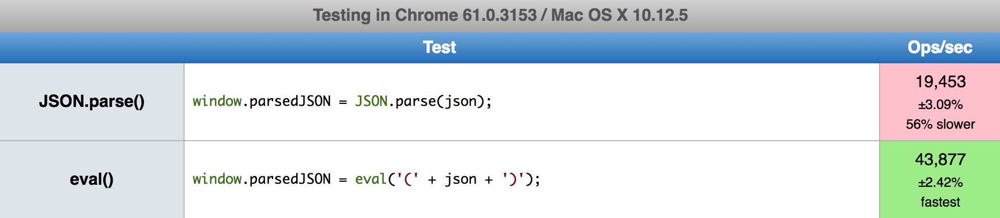
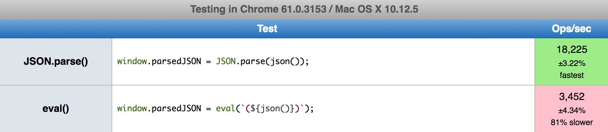

When we're trying to speed up some part of our code, we want quick, targeted
feedback about how our changes perform against the initial implementation. It's
common practice to write a _microbenchmark_: a small program that runs just the
code you're interested in and measures how well it performs. But be warned:
microbenchmarks are fraught with peril, even for experts.

## The Case of the Turbo-Eval

Here's a real story of microbenchmarking gone awry that happened to me recently.

Glimmer compiles its templates into JSON data structures instead of JavaScript,
because parsing JSON, a very simple data format, should theoretically be much
faster than parsing JavaScript, a full-blown programming language.

I wanted to mention it in my JSConf EU talk, but needed to quantify the difference so I
could describe it accurately. (If parsing Glimmer templates is 20% faster, that's interesting, but
if it's 1,000× faster I'm in for a big promotion.) 

I created a microbenchmark for measuring the relative performance of
`JSON.parse()`, which uses a JSON parser, and `eval()`, which uses the browser's
JavaScript parser.

The benchmark looked something like this:

```js
// Setup: example compiled JSON from a Glimmer template
let json = '{"symbols":["@onClick"],"statements":[[6,"button"],[9,"class","remove"],[10,"onclick",[25,"action",[[19,1,[]]],null],null],[7],[0,"×"],[8]],"hasEval":false}';

// Test 1
window.parsedJSON = JSON.parse(json);

// Test 2
window.parsedJSON = eval(`(${json})`);
```

(You can see [the actual microbenchmark on jsperf.com](https://jsperf.com/json-parse-vs-eval-naive/1).)

## Surprising Results

Imagine my surprise to see that `eval()` handily outperformed
`JSON.parse()`: more than 2× faster!



Even after thinking about it for a few minutes, I couldn't easily come up with
an explanation for why `eval()` would be so much faster.

I had to move on because I had a talk to write (and had to drop the claim about
parse performance because I couldn't back it up). But this result kept nagging
at me, because my intuition and the microbenchmark just didn't match up.

Fortunately for me, [Benedikt Meurer](http://benediktmeurer.de/) from Google's
V8 team was attending JSConf EU as well. After my talk, I asked him if he had an
explanation for the results I was seeing.

Benedikt did have the answer, and it wasn't because of some mind-blowing
computer science research they had implemented in Chrome.

## The Mystery Revealed

People use [browser benchmark suites](http://browserbench.org/) to compare the
relative performance of different browsers. At some point, one of these
benchmarks included a test that would run `eval()` over and over again inside a
tight loop. But there was an important detail: inside of
the loop, the string of code passed was the same every time!

Someone on one of the browser teams noticed this and made a small change to their
implementation. Instead of parsing the string from scratch every time, it would
cache the compiled JavaScript on the string itself. If you passed the same
string to `eval()` a second time, it would skip the parse step entirely and
return the previously cached result.

The tech press assigns a lot of weight to browser benchmarks, because it's how
they quantify what the "fastest" browser is at any given time. The moment one
browser added the `eval()` cache and saw their scores shoot up, every other
browser felt compelled to follow suit.

In the real world, `eval()` rarely ever gets called with the same string twice.
But because _this_ benchmark _did_, it became a highly optimized path in every
browser.

And I had similarly erred in creating my microbenchmark. In a Glimmer
application, we never parse the same template JSON twice. I was really
interested in the performance of parsing many _different_ templates. But because
I hadn't considered the possibility that `eval()` might be using a cache under
the hood, my microbenchmark wasn't even testing the thing I cared about.

## An Improved Microbenchmark

Of course, once you understand what's happening under the hood, constructing a
test that defeats the cache is trivial. We can simply include a monotonically
increasing number in the test data to create a unique string each time:

```js
// Setup: example compiled JSON from a Glimmer template
let counter = 0;
function json() {
  `{"${++counter}-symbols":["@onClick"],"statements":[[6,"button"],[9,"class","remove"],[10,"onclick",[25,"action",[[19,1,[]]],null],null],[7],[0,"×"],[8]],"hasEval":false}`;
}

// Test 1
window.parsedJSON = JSON.parse(json());

// Test 2
window.parsedJSON = eval(`(${json()})`);
```

Once updated, I started seeing results that were much more in line with my original
intuition: `eval()` was in fact about 80% _slower_ than `JSON.parse()`, not twice as fast!



[(Updated jsperf.com benchmark)](https://jsperf.com/json-parse-vs-eval-corrected/1)

## The Perils of Microbenchmarking

Talk to anyone who has worked on performance long enough and they will give you
a stern lecture about the dangers of relying on microbenchmarks to determine the
relative performance of two implementations.

While microbenchmarks might be a fine place to start your optimizaiton efforts,
you should *always* validate the results against both your own understanding and
benchmarks that test the application as a whole.

If you see a big improvement in one approach over another, try to understand
_why_ it's faster instead of writing it off as black magic. If I had taken my
first benchmark at face value, I would have made decisions that made my app
slower, all while thinking I was doing the right thing by being "data-driven!"

And particularly with today's incredibly sophisticated optimizing compilers,
it's far too easy for your microbenchmark to be optimized in ways that aren't
possible once running in the context of a real application.

For example, test data tends to be uniform in microbenchmarks, so it's easy for
a JavaScript VM to optimize and inline your function under test. Once out in the
real world, with all sorts of differently shaped objects passing through it,
that fast path may deoptimize and leave you with significantly worse performance
than what you saw in your tests.

Ultimately, the only real cure for microbenchmarks is the ability to test your
changes in real world applications. Doing _that_ correctly is a challenge in
itself, because an app of any sophistication has dozens of confounding
factors that vary each test run, like network performance and randomly-selected
ads.

Fortunately, all is not lost. Stay tuned for an upcoming blog post describing
how to get the determinism and statistical significance of microbenchmarks while
still testing what really matters: how your changes affect the real world experience
of end users.
