How do tools that grew up on the desktop, like Ember, Angular and React, make
the jump to the mobile future?

_This post is adapted from my JSConf EU talk, given May 6, 2017 in Berlin._

<div style="position: relative; padding-bottom: 56.25%; padding-top: 25px; height: 0;">
<iframe style="position: absolute; top: 0; left: 0; width: 100%; height: 100%;" src="https://www.youtube.com/embed/PU94cgLuw9I" frameborder="0" allowfullscreen></iframe>
</div>

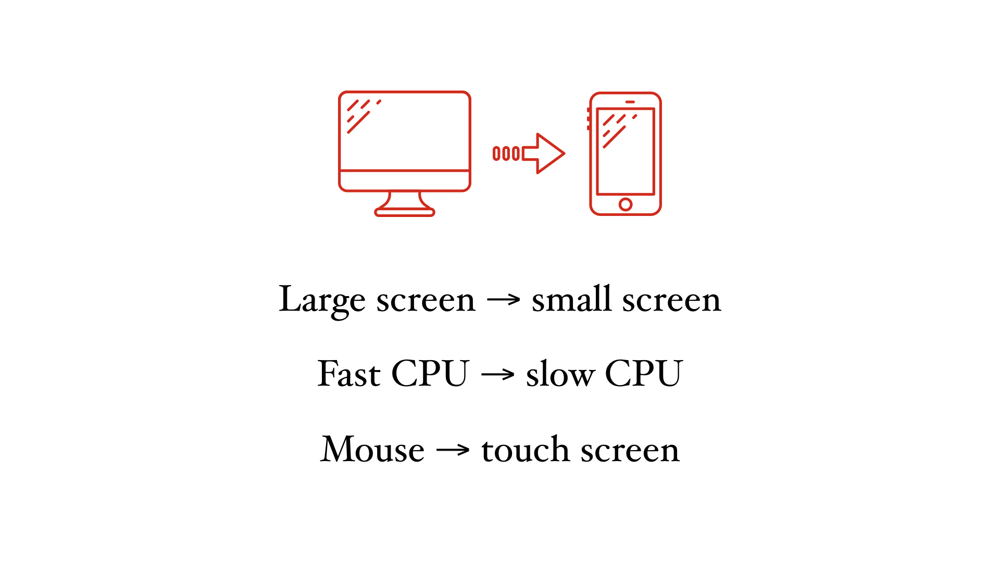

When people think about adapting apps to phones, they often focus on obvious differences,
like screen size, CPU performance and input devices.

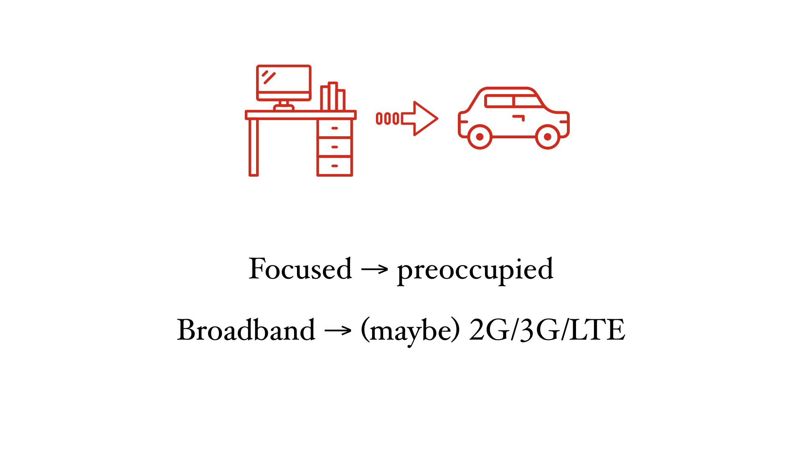

But the context in which a device is used is important, too. Because phones can
be used anywhere, there are very few assumptions we can make, whether that’s how
attentive the user is or whether they have an internet connection at all.


For me, working on a site like LinkedIn is a constant reminder of how truly
global the web can be. In many cases, adapting to smartphones really means
adapting to entirely new users. For many people, their first computer is a
smartphone. That means millions, maybe billions, of people participating online
without ever owning a desktop computer.


The more global your app is, the more combinations of devices and networks
you’ll have to deal with. CPU power can range from a feature phone, to a low-end
smartphone, to the latest iPhone, to a powerful desktop workstation. Network
connectivity can range from GPRS to gigabit fiber to not being there at all.
(Just try riding the subway in New York.) And then there's the fact that each device
may have a different browser, with widely varying capabilities.

Without careful design, it’s easy to optimize for one particular combination of
capabilities at the expense of another. Let's look at an example.

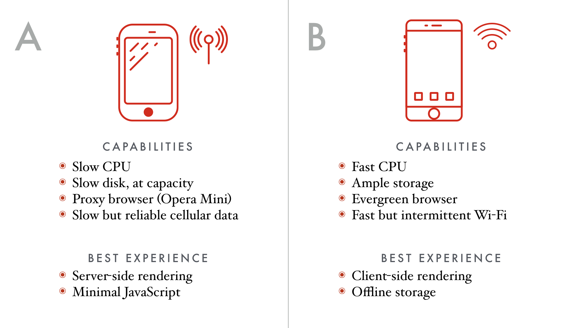

Imagine these two scenarios. User A has a very low-end smartphone, with a CPU
that easily overheats and flash storage so slow it's borderline useless. In
fact, the flash drive is completely full, so it really _is_ useless.

This person’s data connection is quite slow, so they use Opera Mini, which uses
a proxy to heavily compress data before it gets to the phone.

User B has a high-end phone with a CPU that rivals laptop computers and plenty
of fast storage. The only problem is that this person is traveling without any
cellular data, so while they sometimes have access to broadband
internet, it’s only when they’re in range of a Wi-Fi network.

For User A, anything that requires a lot of JavaScript is probably not going to
work at all. Even if they stopped using Opera's proxy, the slow CPU and storage
means that downloading and evaluating a bunch of JavaScript is going to take a
long time. Getting reasonable load times probably means rendering on the server
and keeping the file size of everything as small as possible.

For User B, we want to work more like a native application. We’d be willing to
spend more time upfront to load the entire app and as much data as possible onto
the phone, if it meant that we could still use it when the phone was away from
Wi-Fi.

Historically, the more we’ve tried to optimize for User B and take advantage of
high-end phones and fast networks, the worse we’ve made the experience for the
majority of the world, represented by User A.

***

So what’s the solution to this problem? Can you guess?

I'll give you a hint. It starts with the letters "P" and "E".


Yes! Well done!


No, just kidding. The real answer to this problem is supposed to be progressive
enhancement. But one thing implicit about all of the advice I’ve ever received
about progressive enhancement is that you’re supposed to just do it yourself. It
almost always means rendering on the server and denying yourself the temptation
of using too much JavaScript.

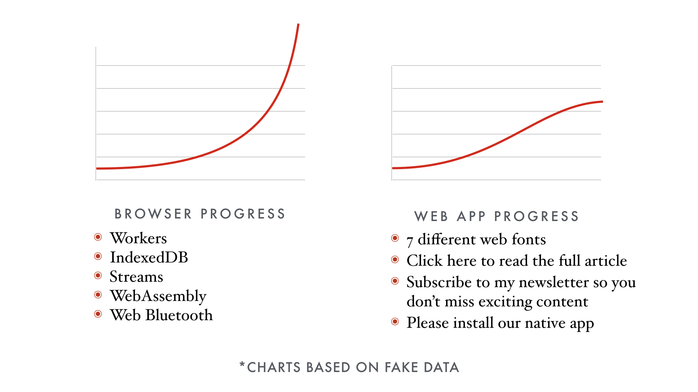

Browsers have advanced at a remarkable rate over the last 10 years. To me, it
feels like the web has more momentum than ever before. Every new browser release
brings so many new features.

Despite all of this incredible innovation, from IndexedDB to Web Workers, to me
it doesn't feel like the day-to-day experience of using web apps has improved
that much in the past 3 or 4 years.

So why don't radical improvements to the browser seem to be translating into
radically improved web applications?


I'd like to propose that this is due to the fact that the cost of code is too damn high.

Taking advantage of all of those new features in the browser requires a lot of
code! Native apps that work offline with beautiful user interfaces are hundreds
of megabytes, and that's not including the SDK that ships with the operating
system.

Just parsing and downloading JavaScript can turn some phones janky. When you bundle all of your JavaScript into a single file, every byte starts to count.

In turn, this sets up misaligned incentives where libraries have to compete on
file size rather than robustness. How do they achieve these improbably small
file sizes? Often, it's by persuading you that the old thing is unnecessarily
complex—the cardinal sin in JavaScript—but they have seen through the BS and
built something simple.
 
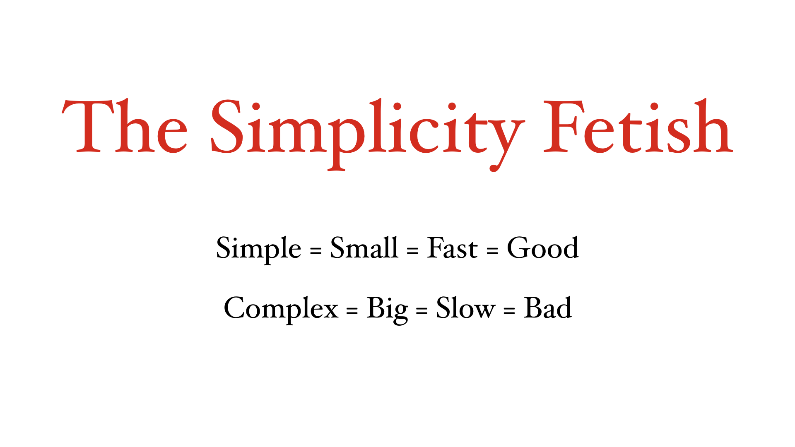

It is this emphasis on file size that leads the JavaScript community to its
simplicity fetish. When file size relies on simplicity, and speed relies on file
size, and speed is paramount on the web, then we have to pretend that simple
tools are the best tools—what other choice do we have?

The only way to write an app that runs well on slower phones and networks is to
ship less JavaScript. Too often, that comes at the expense of handling edge
cases or building higher-level abstractions.

As a community, we often feel like we can’t build sophisticated solutions
because eventually we start to collapse under our own page weight. We’ve seen
this play out several times now. More sophistication = more code = slower load
times.

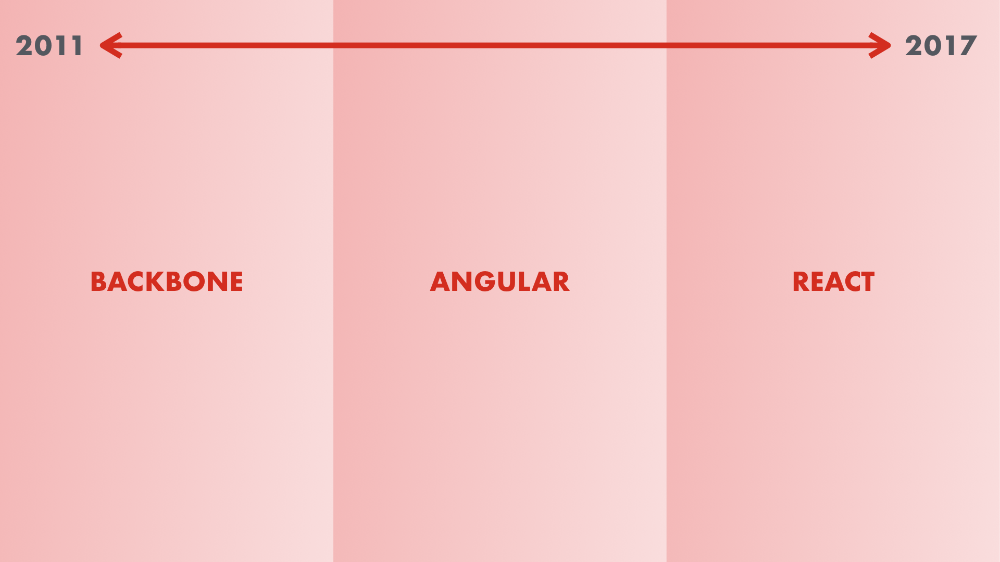

The time period from 2011 to 2017 can roughly be broken up into the Backbone
Era, the Angular Era and the React Era. (This same time period is also sometimes
known as the Ember Era.)


It's easy to become enamored with the simplicity of a tool, and that can lead us
to underestimate the complexity of building modern web apps. Let's hop in the
time machine and see how the simplicity fetish has played out.


In 2011, Backbone was the cutting-edge of web app technology. I remember people
would always say, "I love Backbone's simplicity. I can read and understand all
of its source code in an hour."

But after building a big enough app, it would get slower and slower and they
would discover that one model changing caused the entire app to re-render. No
one on the team understood how the app worked.

But good news! Unlike the complexity of Backbone where you have to listen for
change events and re-render entire view hierarchies manually, Angular's super
simple because you just set a property on your scope and it updates the DOM for
you, automatically.

But after building a big enough app, you discover that the entire thing is a
single controller with 3 million lines of code. Each dirty check takes 5
minutes. No one understands how the app works.

But good news! React solves this problem by being so much simpler than all of
that Angular spaghetti. It can be simpler because it's just the V in MVC.

But after building a big enough app, you discover that you actually need more
than just the V in MVC and your React-Redux-Relay-Router-Reflux-MobX app weighs in
at 7 megabytes, becoming just the F in WTF.

And no one understands how the webpack config works.

***


Don Norman, who you may know as the author of "The Design of Everyday Things," wrote this in an essay about security.

For example, when password rules are too annoying, people just write their password down on a piece of paper on their desk.


I’d like to offer the Tom Dale Simplicity Corollary: the simpler you make something, the less simple it becomes.

Because when simplicity gets in the way, sensible, well-meaning, dedicated
people develop hacks and workarounds that defeat the simplicity.

***

So how do we break out of this local maximum? How do we write one app that can
scale up and down across different devices and performance characteristics?


I think we can learn from native developers, because they had to tackle a similar problem. Different CPU architectures have different instruction sets. If you write some assembly code for x86 and then want to run it on ARM, you have to start over from scratch.

Learning assembly for all of these architectures is a big task. If this was how system software was written, there wouldn’t be much cross-platform code, and introducing new CPU architectures would be borderline impossible.

We figured out a long time ago that a compiler can take a higher-level program
and get it to run across all of these architectures. If a new architecture comes
along, you just have to update the compiler, not rewrite every app in existence.

For example, you can compile C code using Clang and LLVM to WebAssembly, an
architecture that definitely didn't exist in the 1970's:

```
clang -emit-llvm --target=wasm32 -S sample.c
llc sample.ll -march=wasm32
```

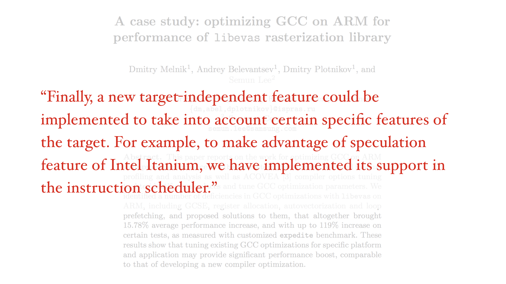

Best of all, not only can a compiler get our code _running_ on different
architectures, it can also _optimize_ it for those architectures. [By encoding
CPU-specific optimizations in the compiler, everyone's code gets faster for
free.](http://ctuning.org/dissemination/grow10-03.pdf)

***

If there’s one thing that I want you to take away from this talk, it’s that
**modern web toolkits are transforming from libraries you call into something
that is more like a compiler**. Except instead of compiling a higher-level
programming language into native code, they’re compiling your higher-level app
into a version highly optimized for delivery over the network.

Eventually, this will mean building multiple versions of an app and delivering the most optimized version for that device. This might be as simple as delivering ES6 builds to newer browsers and transpiled ES5 for older browsers. Or it could be something like automatically transitioning between server-side rendering and client-side rendering based on detected network speed.

Most importantly, these tools can finally embrace complexity by decoupling it from file size. If we can shift the complexity to our build tools rather than monolithic runtime libraries, we can eliminate the enormous pressure to be “simple.”

***


Unfortunately I don’t have a lot of time with you today, but I wanted to highlight three things the teams behind React, Angular and Ember are working on that demonstrate that these frameworks are staying relevant on mobile by becoming compilers.


Prepack is an open source tool from Facebook for optimizing JavaScript evaluation.

The Prepack website uses quite a bit of computer science terminology to explain
what it’s doing. It is genuinely very exciting and very novel. But you don’t
need to understand terms like “symbolic execution” or “heap serialization” to
understand why Prepack has the potential to be a critical tool for optimizing
web apps.

To understand why Prepack is cool, let’s take a step back and understand how a
bundle optimizer like Rollup works.

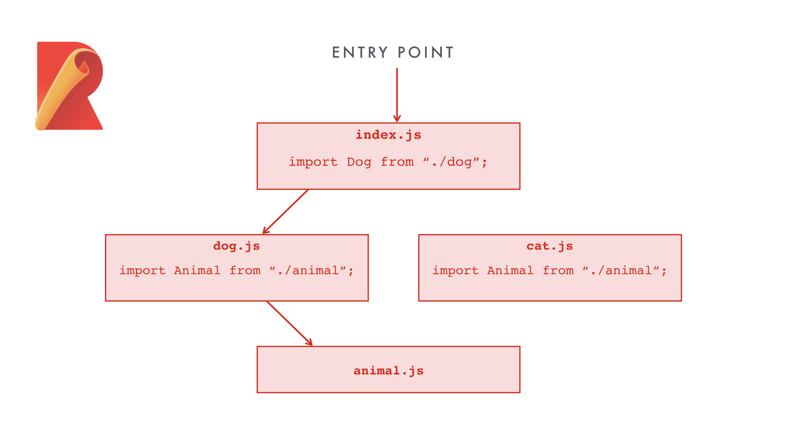

The way Rollup works is by starting with an entry point file and analyzing which
files it imports. For each of those files, it looks at what that file imports,
and so on. Once it’s analyzed the entire graph, it builds a new JavaScript file
that includes just the modules that were actually used.

Let's look at an example from the REPL on the Rollup website.

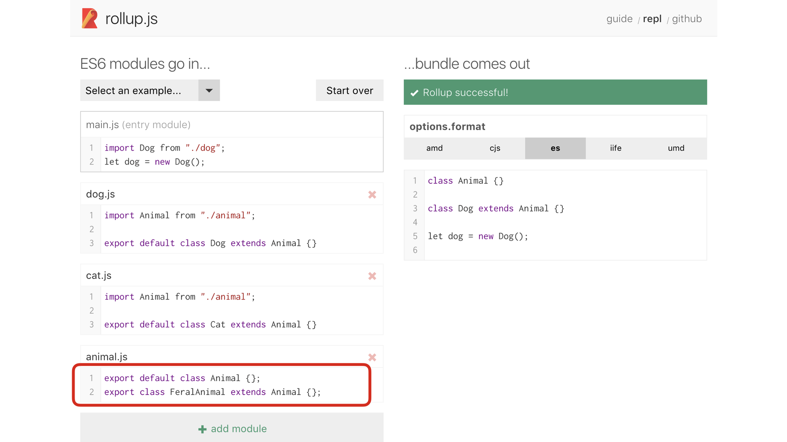

All of our modules are on the left, and the final output file is on the right. Everything we’ve imported is inlined right into the file, and modules that are never imported are excluded. This gives us smaller files by eliminating files we don’t actually use.

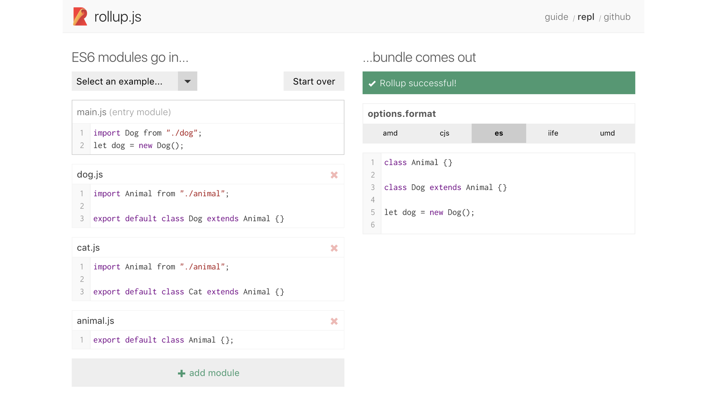

But it’s not just modules. Rollup can do some smart things if it sees exports
that are unused. In this case, note that we’ve added a new class to animal.js,
but our output on the right remains the same. Here, Rollup is smart enough to not
include the `FeralAnimal` class, even though `animal.js` is imported, because no one
asked for that specific export.

This kind of thing is possible because module syntax was specifically designed
to be statically analyzable. Static analysis just means figuring out things
about how a program will run, without having to actually run it. Rollup isn’t
running your code, it’s just figuring out what gets imported and exported.

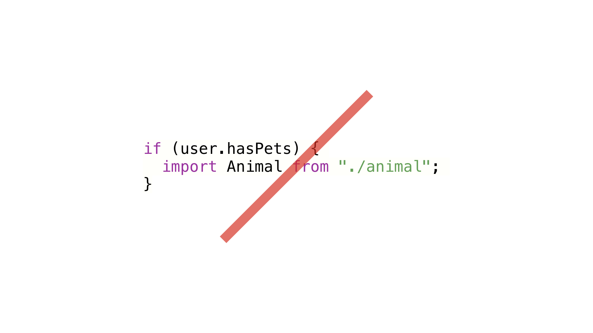

Modules don’t work inside conditionals, so if Rollup sees an import statement,
it knows with certainty that module is always needed. It uses static analysis to
optimize file sizes without actually running any code.


Next, let’s look at a how a modern JavaScript virtual machine like V8 optimizes
JavaScript. Now, V8 can’t help you with file size. By definition, it has to have
downloaded the JavaScript files already. But it can help with making your code
faster.

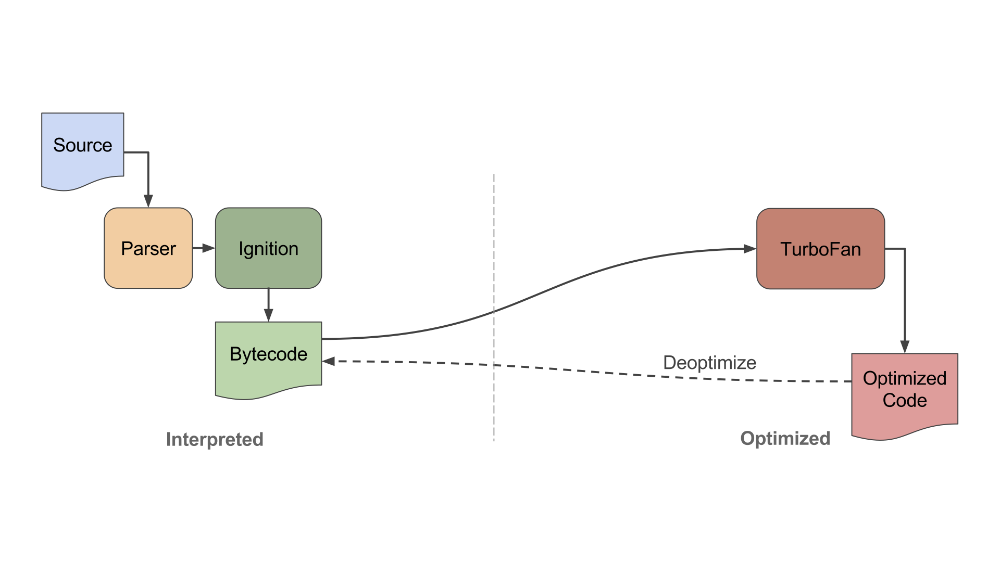

This is the high-level architecture of V8. There are three major components:

1. The parser, which turns your JavaScript source code into a data structure.
2. The interpreter, Ignition, which evaluates your JavaScript.
3. TurboFan, an optimizing compiler, which turns your JavaScript into optimized
   native code. Optimized code takes more memory and time to generate, but it
   can run at truly ridiculous speeds.

As your program executes, V8 keeps track of which parts of your code get run the
most, and how they run. Based on this information, it will ask TurboFan to
create optimized versions of the code that it thinks will help your app run
faster.

V8’s optimizations require running your program. That’s a good thing, since it’s
a JavaScript VM—not running JavaScript would probably be considered a bug.

But because it relies on how the program actually runs, you have to use the
unoptimized code for awhile until V8 can make some decisions. That means things
will take awhile to get really fast, and every user pays that cost, even though
the end result is more or less the same for everyone.

***

So we have this tension between static analysis and dynamic analysis.

Optimizations that use static analysis can be run at build time, meaning you pay
the cost once and all of your users benefit. But static analysis can only get
you so far because you can only perform optimizations you’re 100% sure about. If
a module might get used, Rollup can’t remove it, because if it guesses wrong the
app breaks.

Optimizations that use runtime analysis can collect information about how a
program actually runs, so they don’t have to guess. But requiring the program to
run in order to optimize it is a bit of a Catch 22. By definition, it means the
first run will be running unoptimized code. That’s the the opposite of what we
want on the web, where we want things to feel instant.

That’s what makes Prepack so cool. Similar to V8, it’s an actual JavaScript
virtual machine. Rather than being designed to run in a browser, however, it
runs your app's JavaScript as part of your build. After it finishes running, it
"reverse engineers" a simplified version that is faster for the _user’s_ JavaScript
VM to evaluate.

Understanding Prepack is a talk unto itself and I’m still digesting how it works
internally myself. But let’s look at a few examples of what I mean by _reverse
engineering a simpler version_.

Imagine we’re writing a library that prints the start date of the DinosaurJS
conference. I create a new date object initialized with the start date, then use
that date in a string. Let’s look at what happens if we take this code and run
it through Prepack.

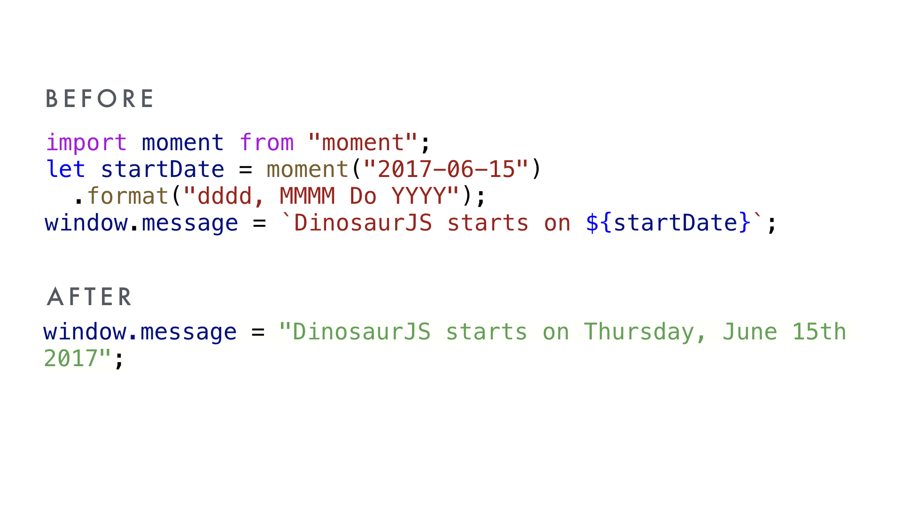

Wow! Prepack has replaced all of that code with a single string literal: the
final result of what I would have got if I actually ran the previous code in
JavaScript.

But now instead of every user having to allocate a Moment.js object, parse a date
string, parse a formatting string, emit the requested string, and then
concatenate it, we have a simple string literal.

In fact, in this example, I can skip including and evaluating Moment.js
altogether, including all of the extra data it needs to turn dates into
locale-specific strings. That's a huge savings if all we're using Moment.js for is
generating this message about when DinosaurJS starts.

This is a contrived example, but you can imagine how each of these small savings
may start to really add up in larger apps, or libraries the size of Ember,
Angular and React.

Prepack is still in the "research" phase and optimizes for raw evaluation
performance over file size, a strategy that can be self-defeating on the web.
But this is an incredibly fresh approach to an old problem, and it makes the
computer science part of my brain light up with glee. I'm very interested to see
where these ideas take us.

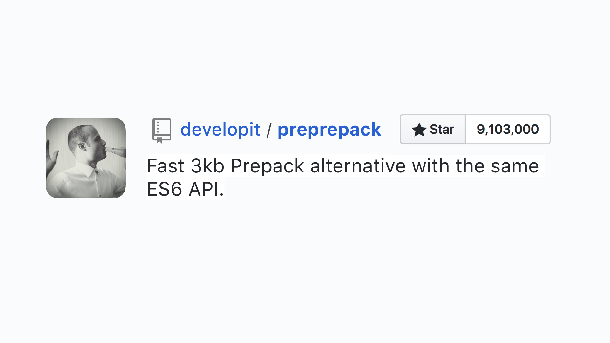

Best of all, I hear rumors that there will soon be a new library from Jason
Miller called Preprepack. It does everything Prepack does in only 3kb of code.

***


Angular bet early on TypeScript, a language I’m a big fan of.

If you’re not familiar with TypeScript, it’s a superset of modern JavaScript,
extended with type annotations. Those types make refactoring much easier,
particularly as your project grows, as well as giving you incredibly rich
autocomplete in your text editor.

But, to me, one of the most exciting and underappreciated reasons to introduce
types to JavaScript is the potential for using that type information to produce
even smaller builds.

Let’s look at a JavaScript minifier like Uglify. Minifiers are very good at
using their knowledge of JavaScript to make changes that don’t affect behavior.

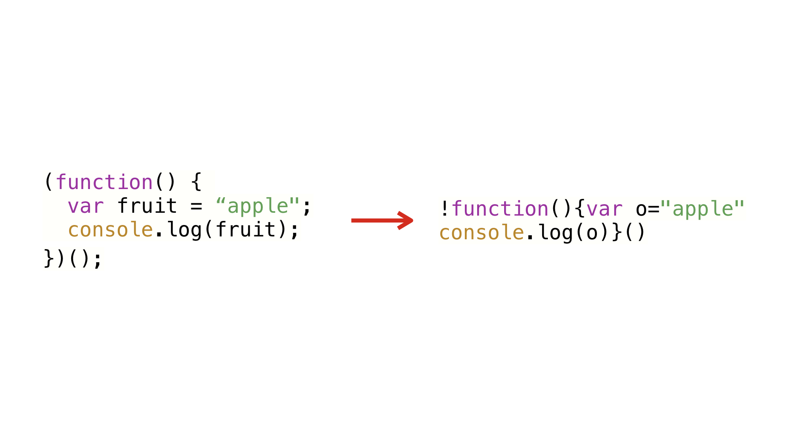

In this example, the variable fruit is renamed to `o`. Because a variable inside
this function can’t be accessed anywhere other than in lexical scope, this is a
totally safe change—it doesn’t change the semantics of the code at all.

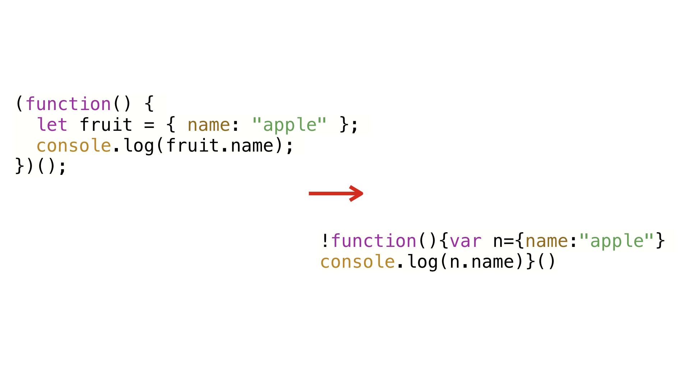

Let’s change this example just a little bit. Instead of making fruit a string,
we make it an object with a name property. Even though the variable fruit still
gets mangled, as you can see, the property name `name` stays the same.

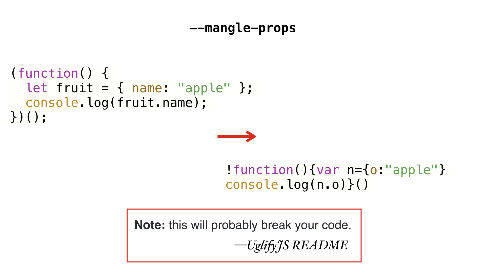

Now, UglifyJS has a property mangling feature that you can optionally turn on.
But unlike renaming variables, renaming properties can break things. The names
of properties and methods on an object are effectively public API—they’re
exposed to the outside world.

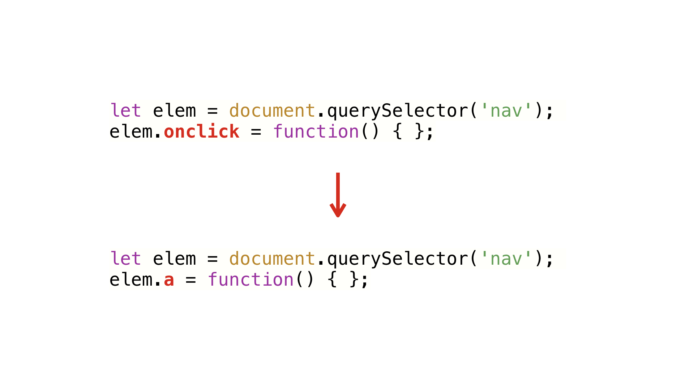

For example, rewriting a DOM element's `onclick` property won’t cause an error,
but it will break your application. If the user clicks the element, it will just
fail silently and the click handler you thought you were installing won’t
actually do anything.

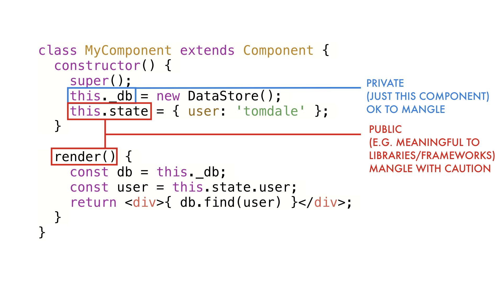

It's very common to have methods and properties on a class whose name is a
critical part of a contract with the outside world. For example, if your React
component's method isn't called `render()`, it will never get run. On the other
hand, there may be properties that should be hidden to the outside world. Those
we can call whatever we want without breaking anything.

So how do we tell our minifier which things are safe to mangle and which are
not? Can we mangle public methods and properties consistently, so `render()`
gets changed to `xyz()` in both our component *and* in React?

There's good news! Google's Closure Compiler already supports this kind of
advanced minification for JavaScript. Unfortunately, it requires annotating
types with JSDoc comments and other weird, Closure-specific configuration. Only
seven people outside of Google have ever gotten an application to build with
`ADVANCED_MODE` turned on.


Fortunately, the Angular team released an amazing tool called Tsickle that
translates a TypeScript project into the format that Closure Compiler expects.
By using the extra information that TypeScript provides, and because Angular is
written in TypeScript too, Closure Compiler can do some shockingly advanced
minification.

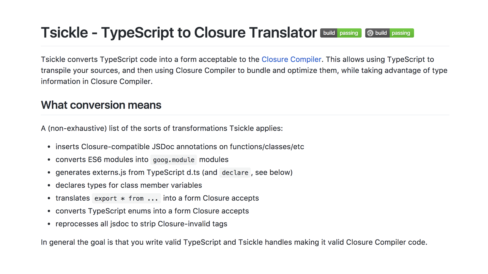

As the readme says, the goal is to let you write TypeScript, and Tsickle handles
massaging it into something Closure Compiler understands. I am really excited to
see Googlers working on making Closure Compiler's underappreciated power more
accessible to the broader world. Integrating this into ng-cli by default would
make a huge, practical impact on the final size of the average Angular app.

By adding types to JavaScript, and by having a compiler that understands your
app and all of its dependencies as a holistic universe, you can make
mind-boggling improvements to the way we minify code today. This is an area of
exploration I'm really excited about.

***


Last, let's talk about Ember. More specifically, I want to tell you about some
of the cool stuff we’ve been working on in Glimmer. Glimmer is the rendering
engine in Ember, and in March we [extracted it into a standalone library called
Glimmer.js](https://www.glimmerjs.com) that can be used outside of Ember.

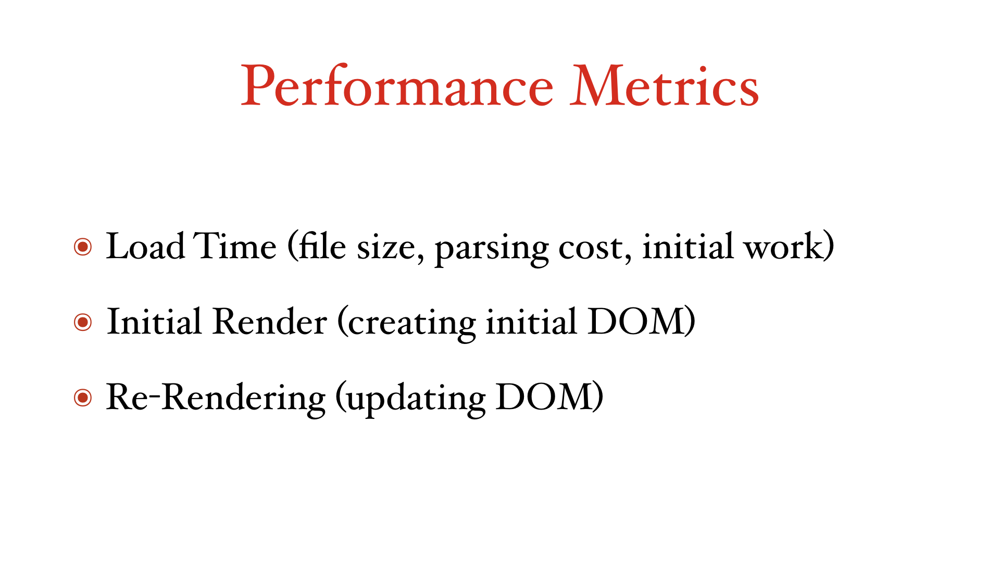

When we think about the performance of a web UI library, there are three major metrics to look at.

First, how long does it take the library to load? The fastest rendering library in the world probably wouldn’t be worth it if it was 50MB. But file size alone is just a proxy for load time. Given two files with identical size, one may take longer to load than the other because it contains more complicated JavaScript. (This is something Prepack is designed to optimize.)

Second, how long does it take to render a component for the first time, when you have to create brand new DOM elements?

Third, how long does it take to re-render a component, updating its existing DOM elements instead of replacing them?

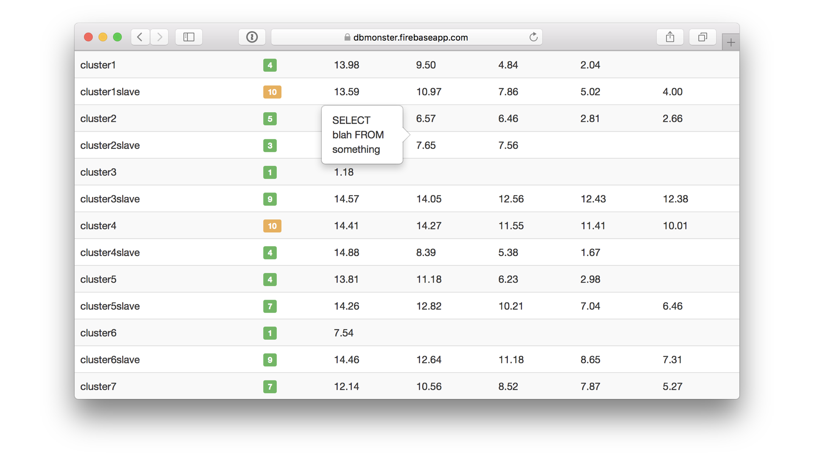

Remember this app? Ryan Florence’s dbmon demo app highlighted the benefits of
React’s virtual DOM diffing strategy. For awhile, it set off a frenzy of
performance benchmarks and it’s all anyone was focused on. More recently, the
community’s focus has shifted to initial load times, as people have grappled
with low-end phones and slow networks.


The tricky thing is trying to find the sweet spot that balances between
optimizing the first render and optimizing re-renders. Fundamentally, this is an
issue of bookkeeping. The more bookkeeping you do in the initial render to make
subsequent updates faster, the longer that initial render is going to take.

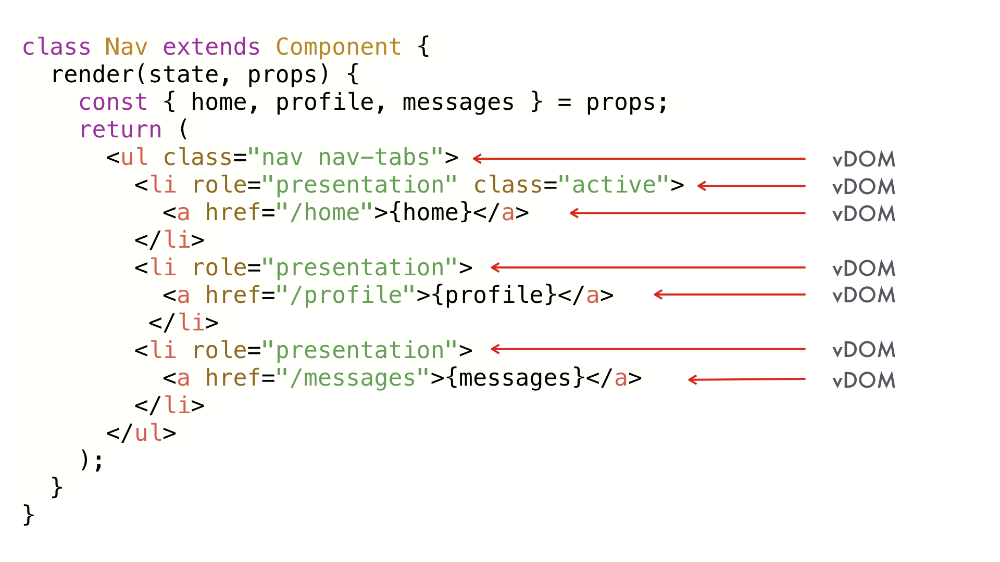

Consider this React component using Bootstrap markup. On initial render, virtual
DOM nodes will be created for each element here—that makes a lot of sense. These
are basically just instructions for how to create the real DOM.

But if a single prop changes, we have to run the entire render function again.
That’s quite a few allocations of vDOM objects, not to mention the diffing that
has to happen to reverse engineer what changed between the last render and this
render. This example is small enough that the performance cost is negligible,
but in large apps or inside a loop, this can really start to add up. Can we do
better?

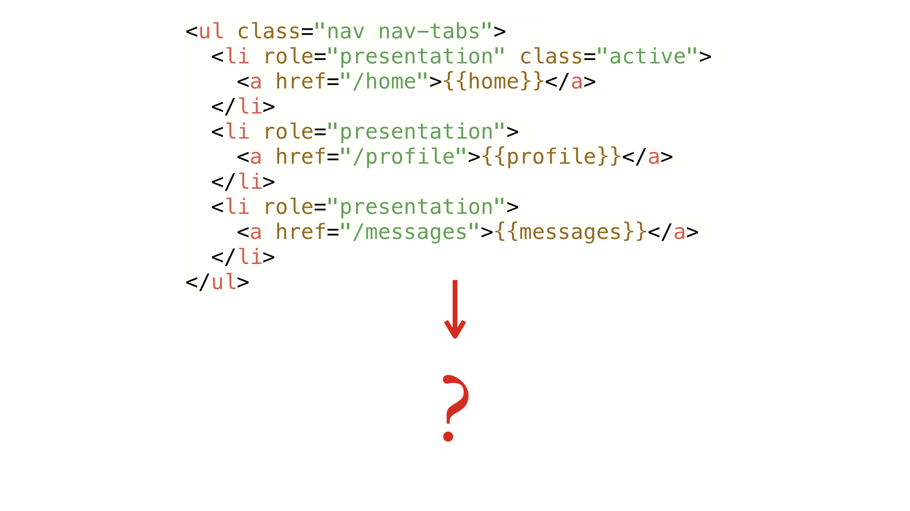

Glimmer uses Handlebars templates for components, and these get compiled when
you build your app. The question is, what do we compile these into?

In Ember’s history, the answer to this question has changed three times. With
Glimmer, we tried an approach that we thought could balance the fast initial
rendering of virtual DOM while improving on update performance. We did it by treating
Handlebars and the entire rendering pipeline like a programming language and
virtual machine to run it.

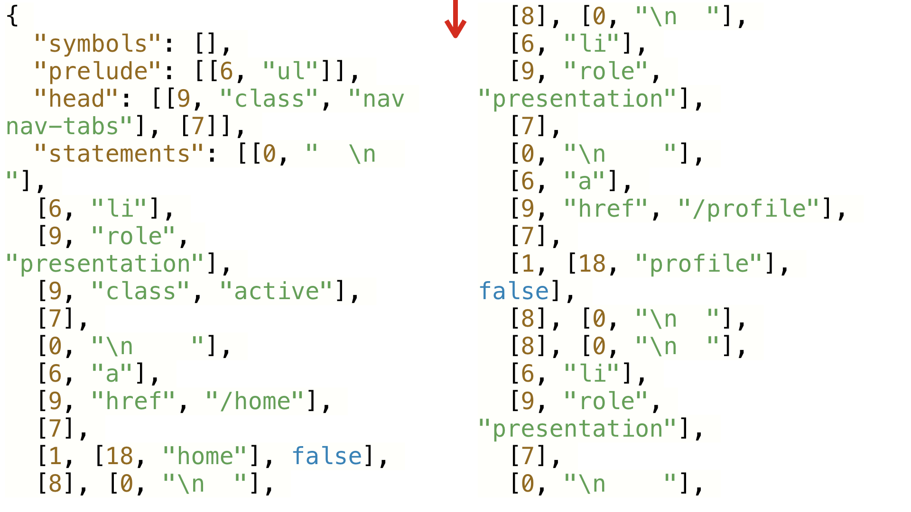

In Glimmer, we compile this template into a JSON object that looks like this.
This probably looks like gobbledy-gook to you. What this object represents is
actually a sequence of opcodes, or instructions, that tell the Glimmer VM how to
build a DOM structure.

We represent the opcodes in a compact JSON data structure of arrays, integers,
and string literals. Parsing JSON is much faster than parsing the JavaScript
that Angular templates and JSX compile down to, and the result uses less memory
as well. When we landed Glimmer in Ember 2.10, many apps found that their
template size dropped 70-80%.

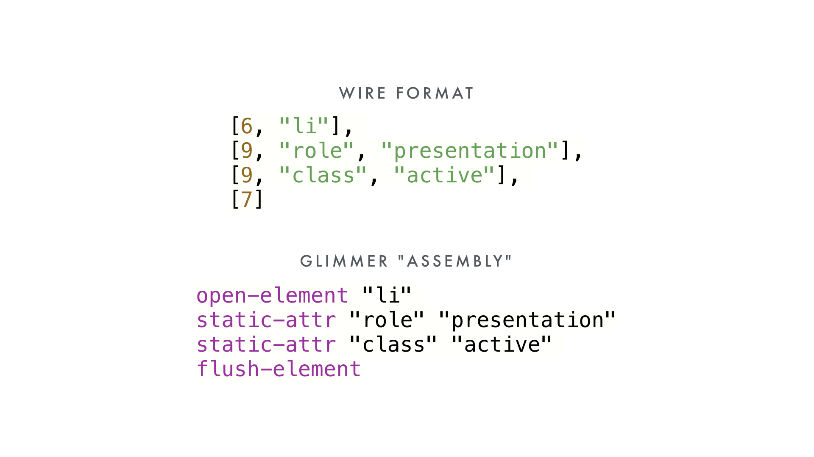

We use integers to represent instructions, both for compactness and because of
the JavaScript VM optimizations it unlocks. But if were to represent it in a
(totally hypothetical) assembly language, it might look like this: a linearized
sequence of instructions.

To build our DOM, we iterate over the list of instructions, each one building up
a bit of an element.

This is an easy example, because it's completely static. What about something that has dynamic content?


What I haven't mentioned yet is that Glimmer VM is actually made up of two VMs.
One is optimized for constructing and appending DOM elements, the other is
optimized for updates.

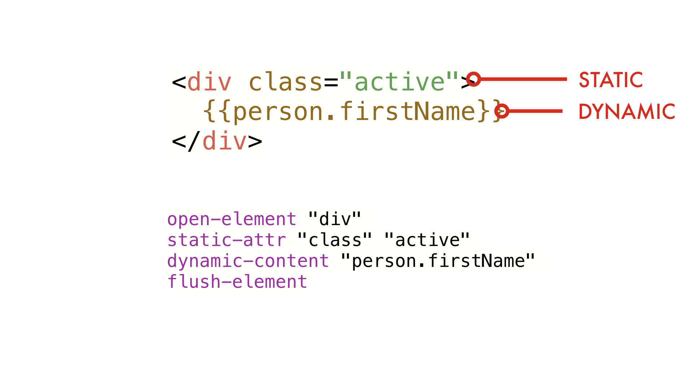

This is the program for initially rendering this template. To build up this DOM element,
we execute each instruction in order.

If the underlying data changes, we _could_ run this again for updates, but
there's no point in spending time executing opcodes for static content that
we know hasn't changed (like the `class` attribute).

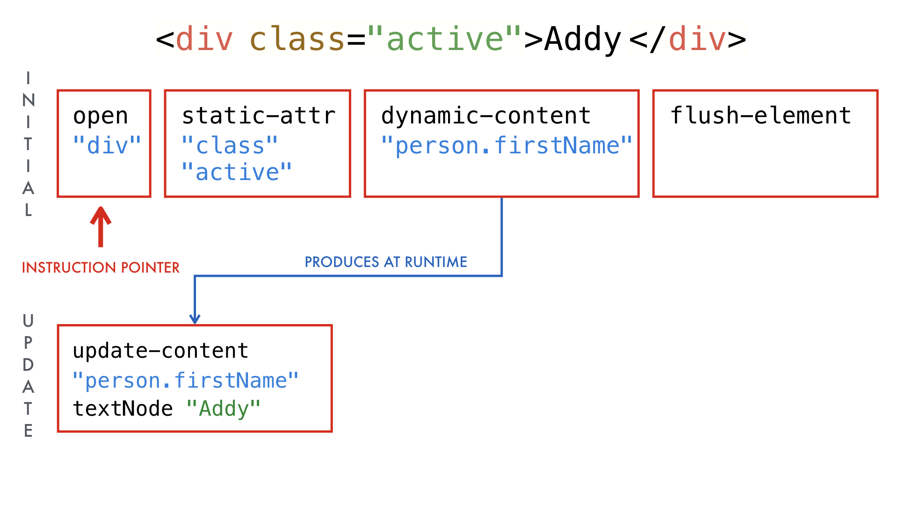

Instead, we use a technique called partial evaluation to generate the updating
program as the initial rendering program is being run. Essentially, operations
in the initial rendering program are responsible for generating the opcodes to
update themselves should the underlying data change.

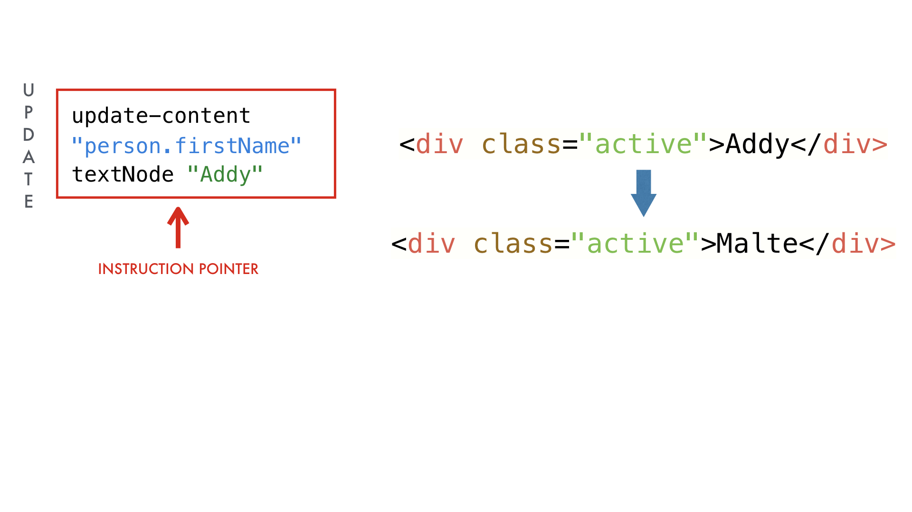

In this case, because there's a single piece of dynamic content in our template, we only have to perform a single operation to update it.

And that also means diffing a single _value_, rather than a virtual DOM tree. We
can skip having to allocate new objects and perform a tree diffing algorithm.
You can think of our entire diffing step as being equivalent to:

```js
if ("Addy" !== "Malte") {
  textNode.content = "Malte";
}
```

(It's obviously a little more complicated than that under the hood.)

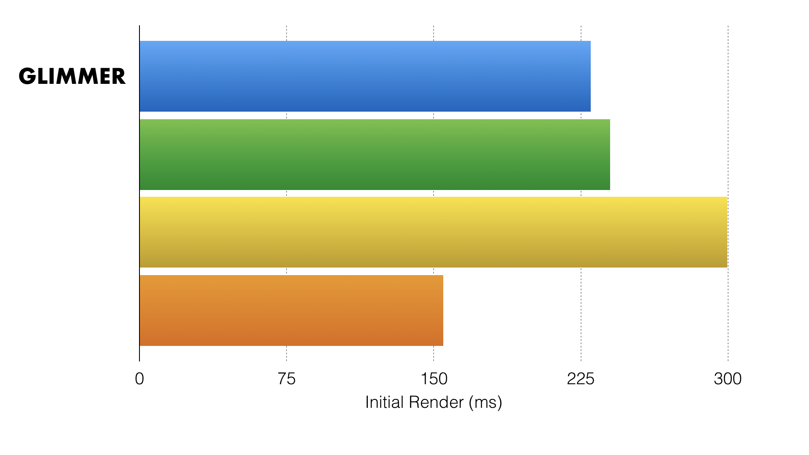

We noticed that basically all rendering library benchmarks only tested pure
dynamic content. But that's not representative of most apps in the real world,
where you have plenty of `<div>`s and other semantic markup. When we created a
benchmark with a mix of both, initial rendering was neck and neck with virtual
DOM-based libraries. I'm not putting the names here because the point isn't to
be a competition. I want to show that, even though we're not the fastest, we're
in the same ballpark as other virtual DOM-based libraries.

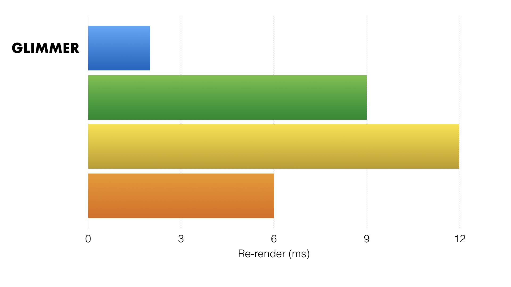

However, when we moved to measuring updating performance, we were very happy to
see that the partial evaluation optimization seemed to make a big difference.

***

Today we've talked about three popular frameworks and some of the things they're doing to improve performance on mobile devices.

It's important to understand that modern frameworks are becoming optimizing compilers, not just something that you drop in to a page with a `<script>` tag.

But this is just the beginning. There's an exciting trend towards sophisticated
tools that can analyze your app and perform optimizations that would be
time-consuming, if not practically impossible, to write yourself. Best of all,
code that clearly conveys intent to compilers has a funny way of being able to
convey intent to humans, too.

In 2017, the idea that build tools are optional is, in my opinion, out of touch
with reality. A sophisticated build process is the backbone (pardon the pun) of a
modern web app.

Every JavaScript conference has at least one talk where the speaker shows a
bunch of techniques for measuring and improving the performance of your web
apps. That's awesome information to have. But not everyone can have a web
performance expert always standing over their shoulder, showing them how to
balance performance across so many devices.

I for one am incredibly excited that our community has started to builds tools
to help democratize and commoditize that performance know-how.


The best part of approaching frameworks as compilers isn't just that they help
today's apps become accessible to more people. By reducing the cost of code, we
can build better apps that don't collapse under the weight of their own
complexity.

By reducing the cost of code, we can finally dispense with an idea I have always
hated: that developer happiness and user happiness are somehow inherently in
tension.


This is an exciting time to be a JavaScript developer. I for one am looking
forward to web apps that load instantly, work offline, and feel great to use—for
everyone.


