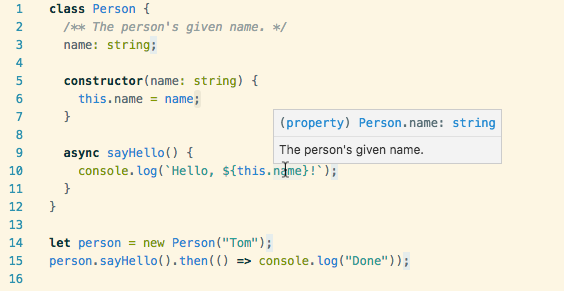

Two weeks ago at EmberConf, we announced [Glimmer.js](https://glimmerjs.com/), a
component-based library for writing superfast web applications. In the demo video, we use TypeScript to write our Glimmer components. Some
people have been asking, what’s the deal? Have we turned our backs on JavaScript
and embraced our new TypeScript overlords?

*****

I’m not usually a fan of “alternative” JavaScript. All the way back in 2013, for
example, [I was arguing against adopting
CoffeeScript](https://meta.discourse.org/t/is-it-better-for-discourse-to-use-javascript-or-coffeescript/3153/11).
It was easy to see that there was important new functionality coming in ES6 and
beyond, and it wasn’t clear how CoffeeScript users would be able to take
advantage of it.

For example, CoffeeScript adopted `for..of` loops to iterate over the properties of an
object. Meanwhile, ES6 introduced its own `for..of` loops as a way to loop through
iterable objects. If CoffeeScript wants to support new functionality with
similar syntax like this, it has two choices: break existing CoffeeScript code,
or diverge from JavaScript more and more over time.

Because JavaScript is the lingua franca of the web, and the web is everywhere,
it is a programming language subject to enormous compatibility constraints. The
smallest language change can potentially render millions of sites inoperable.

I have witnessed the intense amount of thought and care TC39 members devote to
figuring out how to introduce modern language features in a way that is
completely backwards-compatible. It involves dumping out all of the existing
features and syntax on a table, and painstakingly moving them around until a
compatible path can be traced through.

Unfortunately, this heroic effort only helps JavaScript, not “alt-JavaScript.”
At the end of the day, transpiled languages suffer from one of two problems:

1.  “JavaScript-alikes” like CoffeeScript will have to break their own backwards
compatibility, or diverge from JavaScript (and thus become less JS-alike over
time).
1.  Languages with totally different syntax and semantics, like ClojureScript, are
difficult to debug, even when source maps are working perfectly.

But not TypeScript. TypeScript is different.

*****

TypeScript is different because of how radically constrained it is.

Most transpiled languages exist because they want to correct some perceived
deficiencies in JavaScript. It’s hard to quantify, but you can *feel* the
respect that the TypeScript team has for JavaScript. They’re not trying to
rescue an inherently flawed language; instead, they’re trying to help a language
they love reach new heights.

I love TypeScript because the delta between it and JavaScript is so small. In
fact, you can take any JavaScript file, change the extension to `.ts`, and boom,
you’ve got a valid TypeScript file.

*Because TypeScript is a superset of JavaScript, you’ve actually been writing
TypeScript this whole time.*

From there, you can incrementally add type checking only where you think it’s
necessary.

It’s easy for people to have a visceral negative reaction to TypeScript. Let’s
be frank: a lot of TypeScript examples are nearly indistinguishable from Java.

But two points:

1.  All of that extra type syntax is optional; only use it if it’s bringing you
benefits.
1.  Don’t get fooled into thinking that TypeScript is as awkward and occasionally
frustrating to use as Java. Behind that Java-like syntax is a language that is
every bit as flexible and dynamic as JavaScript because, well, it *is*
JavaScript.

## JavaScript + Types = TypeScript

For people who haven’t used TypeScript, it’s easy to imagine that it might be a
bunch of weird, complicated new stuff on top of JavaScript, in addition to
types. In reality, TypeScript is just JavaScript plus the smallest possible set
of syntax additions required to let you incrementally typecheck your code.

What’s incredible about the TypeScript compiler is that it doesn’t transpile
code so much as just strip out type annotations. Debugging is straightforward
because each line of TypeScript corresponds to the same line of JavaScript, just
without the types.

Here's an example TypeScript file:

```person.ts
class Person {
  /** The person's given name. */
  name: string;

  constructor(name: string) {
    this.name = name;
  }

  async sayHello() {
    console.log(`Hello, ${this.name}!`);
  }
}

let person = new Person("Tom");
person.sayHello().then(() => console.log("Done"));
```
And the resulting compiled JavaScript (targeting ES2017):

```person.js
class Person {
  constructor(name) {
    this.name = name;
  }
  async sayHello() {
    console.log(`Hello, ${this.name}!`);
  }
}
let person = new Person("Tom");
person.sayHello().then(() => console.log("Done"));
```

As you can see, we’re using cutting-edge ES2017 features like async functions,
and the syntax is exactly the same across both. The only difference in the
TypeScript version is that we declare the fields on the  class, as well as the
type of the arguments to the constructor; these simply disappear in the
JavaScript output.

And even these simple annotations quickly begin to pay dividends. For example,
using a TypeScript-enabled editor like VS Code gives us detailed information
about class properties, just by hovering our mouse over them:



> “But I still don’t want to use TypeScript!”

And that’s totally cool! Glimmer is a library, first and foremost, for writing
*JavaScript* apps. If you don’t want to use TypeScript, you should have the
freedom not to.

> “That’s what Angular said and look how that turned out.”

OK, I guess this is maybe the elephant in the room. A lot of people’s first
exposure to TypeScript was Angular 2. Looking at the Angular website, it’s easy
to get the sense that using TypeScript means JavaScript becomes a de facto
second-class citizen.

For example, here’s an Angular component in TypeScript:

```ts
import { Component }   from '@angular/core';
import { DataService } from './data.service';
@Component({
  selector: 'hero-di',
  template: `<h1>Hero: {{name}}</h1>`
})
export class HeroComponent {
  name = '';
  constructor(dataService: DataService) {
    this.name = dataService.getHeroName();
  }
}
```

Here’s the same thing in ES6 JavaScript:

```js
import { Component }   from '@angular/core';
import { DataService } from './data.service';
export class HeroComponent {
  constructor(dataService) {
    this.name = dataService.getHeroName();
  }
}
HeroComponent.annotations = [
  new Component({
    selector: 'hero-di',
    template: `<h1>Hero: {{name}}</h1>`
  })
];
HeroComponent.parameters = [
  [DataService]
];
```

As you can see, the JavaScript version is quite a bit longer than the TypeScript
version. So why wouldn’t Glimmer suffer the same fate?

The primary reason is that *Angular relies on an experimental TypeScript feature
that emits type information in the compiled JavaScript* (i.e., `emitDecoratorMetadata`). Dependency
injection is front and center in Angular, [so they (very rationally) decided to
use the types you’d write anyway to power the DI
system](http://nicholasjohnson.com/blog/how-angular2-di-works-with-typescript/).

I actually think this is a cool example of improving developer ergonomics in
Angular by using existing type information, but it does have the unfortunate
effect of requiring different, often awkward APIs for people who want to use
JavaScript.

Glimmer goes in the other direction. We like that TypeScript is just JavaScript,
so the APIs you use in both languages are exactly the same. Because Glimmer is
written in TypeScript, you get great autocompletion and type checking out of the
box, but there’s no requirement to use TypeScript, and there’s no alternate set
of APIs for JavaScript.

*****

After having used TypeScript for nearly a year, I have to confess: I never want
to start a new project without it again.

Refactors that used to take weeks take days, sometimes less. And because
refactoring is so much easier, cleanup that would never have happened becomes…
almost painless.

In literally every case, converting a project from JavaScript to TypeScript has
identified at least one bug. Because I’m now aware of the kinds of bugs
TypeScript catches automatically, writing code without it feels like walking a
tight rope without a net.

Most of all, I continue to be impressed by the professionalism of the TypeScript
team. In an ecosystem that can feel built on a house of unmaintained cards,
TypeScript’s drumbeat of constant, iterative improvement is refreshing.

TypeScript is exploding in popularity and I think it will continue to only get
more popular. As I finish writing this post, [Felix Rieseberg’s post on using
TypeScript at Slack is on the front page of Hacker
News](https://slack.engineering/typescript-at-slack-a81307fa288d). I suspect
that most people who try TypeScript will end up liking it.

At the end of the day, though, JavaScript is the language of the web. It’s our
job to give you a library that feels great whatever you choose.

That’s why we design our APIs for JavaScript first, and thanks to TypeScript’s
love for JavaScript, it couldn’t be easier.
